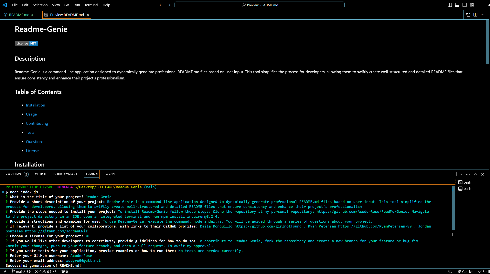

# Readme-Genie

## Description

Readme-Genie is a command-line application designed to dynamically generate professional README.md files based on user input. This tool simplifies the process for developers, allowing them to swiftly create well-structured and detailed README files that ensure consistency and enhance their project's professionalism.

## Table of Contents

- [Installation](#installation)
- [Usage](#usage)
- [Contributing](#contributing)
- [Tests](#tests)
- [Questions](#questions)

- [License](#license)

## Installation

To install Readme-Genie follow these steps: Clone the repository at my personal repository: https://github.com/AcoderRose/ReadMe-Genie, Navigate to the project directory in an IDE, open an integrated terminal and run npm install inquirer@8.2.4.

## Usage

To use Readme-Genie, execute the command: node index.js. You will be guided through a series of questions about your project.

[Link to Walk Through Video](https://app.screencastify.com/v3/watch/wUyHUwlShTU0gteJo4mA)

## Credits

Kaila Ronquillo https://github.com/girlnotfound , Ryan Petersen https://github.com/RyanPetersen-89 , Jordan Gonzales https://github.com/JordanGWiz

## License

This project is licensed under the MIT license.

## Contributions

To contribute to Readme-Genie, fork the repository and create a new branch for your feature or bug fix. Commit your changes, push to your feature branch, and open a pull request. To await my approval…

## Tests

No tests are needed currently.

## Questions

For any questions, please contact me via:

- GitHub: [AcoderRose](https://github.com/AcoderRose)
- Email: addyro96@att.net
